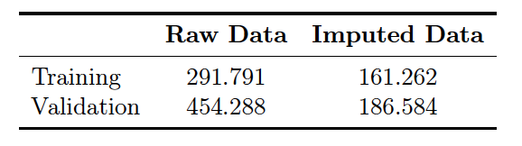
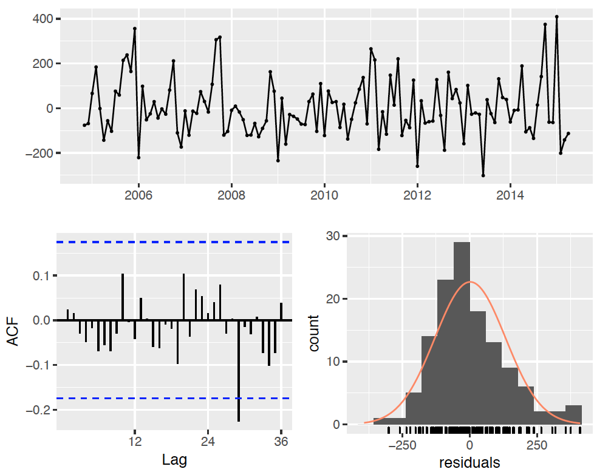
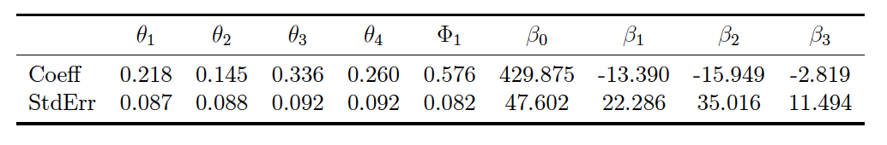

```{r setup, cache=TRUE, echo=FALSE, message=FALSE, warning=FALSE, show=FALSE}

knitr::opts_chunk$set(echo = FALSE, show = FALSE, warning = FALSE, message = FALSE, cache = TRUE)

library(knitr)
library(png)

# library(knitcitations)
# 
# bibliography()
# 
# bib <- read.bibtex("references/my_bib.bib")

#source("thesis-code.R")
```

# Introduction

## The Retention Problem

* Personnel management is a concern for any organization

* The Department of Defense (DoD) in particular is concerned with retention as
it must grow its leadership from the bottom

* The military places unique stressors on its members and their families, who play 
a significant role in individual retention decisions (Fugita and Lakhani 1991)

  + These stressors can also help create highly desirable skill sets (Kane 2012)

* Civilian labor markets can offer competitive compensation (Kane 2012)

## Econometric Approach

* Saving, et al (1985) find evidence that civilian wages and unemployment could 
be related to retention patterns

* Schofield (2015) uses logisitic regression to identify key demographic factors 
affecting non-rated attrition

* Franzen (2017) applies similar methods to the rated officer corps, primarily 
focusing on demographic variables, and also finds evidence of economic influence

* Jantscher (2016) utilizes correlation analysis to identify economic indicators 
correlated with retention, and attempts to model retention with a regression model

## Assumptions and Limitations

* We assume that there exists at least one economic indicator that inform an individual 
member's retention decision

* Standard assumptions associated with regression modeling and forecasting are made

# Methodology Overview

## Prerequisites

* Regression modeling utlizes exogenous variables (predictors) to predict a separate variable (response)
  
  + Assumes predictor variables are independent of each other 

  + Assumes errors are normally and independently distributed with a mean of zero 
and constant variance

  + Seeks to explain variance in response using predictors

## Prerequisites

* Times series modeling relies on the relationship between a variable and previous
observations of itself, known as autocorrelation

* Stationarity refers to the mean and variance of a time series variable

  + A stationary variable's value does not depend on the time at which it is observed

* Differencing is one method for treating non-stationary variables

  $$ y_t' = y_t - y_{t-1} $$

## Prerequisites

* Backshift notation is often used when defining time-series models

  $$ B^ky_t = y_{t-k} $$

* Specifying a model often involves splitting the data into at least two sections, 
training and validation

 + The training set is used to estimate parameters of the theorized model
 
 + The validation set is used to assess model performance
 
## Prerequisites
 
* Model performance and fit is assessed by the behavior of the residuals, and several
criteria: 

  + Corrected Akaike Information Criteria (AICc) estimates information loss
  
  + Training and Validation root mean square error (RMSE) summarizes the discrepancy 
  between predicted values and observed values

## Data Composition

* The Strategic Analysis branch of the Force Management Division of Headquarters 
Air Force (AF/A1XDX) provided monthly observations of voluntary separations from
the officer corps from October 2004 to September 2017

  + Data are retrieved from the Military Personnel Data System (MilPDS)
  
  + Data input is a mix of manual contributions by trained personnelists and 
  automatic updates

  + Total of 157 observations across 67 AFSCs
  
## Data Composition

* Federal Reserve Bank of St. Louis maintains a freely accessible economic database, FRED

* Historical data on several economic indicators were retrieved: unemployment 
(seasonally adjusted and not), labor force participation, job openings 
(adjusted and not), job quits, labor market momentum, real gross domestic product
per capita, and the consumer price index

* Job indicators are from the nonfarm sector, and all indicators have been
seasonally adjusted unless otherwise specified

* Missing values, date modification, data merging

# Analysis and Results

## Initial Exploration

* Significant spikes during 2005, '06, '07, and '14 and no obvious seasonality

{ width=250px }


## Initial Exploration

* Separating by year reveals seasonality in response

{ width=250px }

## Initial Exploration

* We know from the data provider that the spikes in attrition were most likely due
to special programs designed to incentivize attrition

* Opt to replace outliers with the average of the corresponding months

  + e.g. November 2006, '07, and '14 are replaced with arithmetic mean of November
  observations in all other years
  
## Initial Exploration

* Data are much better behaved, and appear stationary

{ width=250px }

## Initial Exploration

* Seasonality effects are much more pronounced in the imputed data set

{ width=250px }

## Initial Exploration

* We fit a naive model to both the raw and imputed data to compare
the effect on RMSE

* The naive results also provide a baseline to compare later models against

  + If other models perform worse than the naive, then they aren't useful

{ width=250px }

## Dynamic Regression

* Naive models are simple, regression models adequately involve exogenous 
predictor variables, and time-series models handle autoregressive components of 
data

* The last two techniques are combined in the dynamic regression model 
(or transfer function)

  + A multivariate regression is fit using economic indicators as predictors, and 
  an ARIMA model is fit on the errors
  
## Dynamic Regression  
  
* The general formulation of a dynamic regression model with ARIMA(1,1,1) errors is:

$$ y_t = \beta_0 + \beta_1x_{1,t} + ... + \beta_kx_{k,t} + n_t $$
where,

$$ (1-\phi_1B)(1-B)n_t = (1+\theta_1B)e_t $$
and $e_t$ is white noise.

## Dynamic Regression

* A correlation matrix of candidate regressors is generated to help avoid 
interdependent predictor variables

{ width=245px }

## Dynamic Regression

* Unemployment, labor force participation, and labor market momentum have low 
correlation and are selected for initial modeling

* Before modeling, we must assess the stationarity of these regressors

  + Dynamic regression requires that the predictor variables are stationary 
  in addition to the response
  
## Dynamic Regression

* Clear evidence of non-stationarity, so we look to differencing

{ width=250px }

## Dynamic Regression

* Simple differencing produces desired effects, regressors now show month to month
change in indicators

{ width=250px }

## Dynamic Regression

* We move to the ARIMA portion of the model

  + Up to six parameters can be specified: the order of autoregression, degree 
  of differencing, the order of the moving average ($p, d$ and $q$, respectively), 
  and their seasonal counterparts ($P, D$ and $Q$)
  
* A range is specified for each parameter, and model is fit for every combination 
within those ranges

* The model with the lowest AICc is selected

* All subsequent dynamic regression models are selected in this manner, using the
ranges/values: $p,q \in [0,5]$, $d,D = 0$, and $P, Q \in [0,2]$

## Dynamic Regression

* The first model selected was a regression model with a fourth-order moving average
and first-order seasonal autoregression on the errors:

$$ y = \beta_0 + \beta_1x'_{1,t} + \beta_2x'_{2,t} + \beta_3x'_{3,t} + n_t$$
where, 
$$ (1-\Phi_1 B^{12})n_t = (1 + \theta_1B + \theta_2B^2 + \theta_3B^3 + \theta_4 B^4)e_t $$
and, 
$$ x'_{i,t} = x_{i,t} - x_{i,t-1}$$

## Dynamic Regression

* To assess model adequacy, we first look at the residuals

{ width=250px }

## Dynamic Regression

* Unfortunately, the regression coefficients have high standard errors, implying
that none of the economic indicators significantly explain the variance in attrition

* Instead, the ARIMA model handles all the information and regression provides 
no insight

{ width=375px }

## Dynamic Regression

* There could be several reasons for the insignficant regression coefficients:

  + Month-to-month changes in economic data are mostly marginal, possibly 
  resulting in minute effects on attrition
  
  + Economic and personnel data are both aggregated to the national level, and 
  it is possible that the aggregation includes enough noise to mask any effects
  
  + Indicators currently only show the previous month's change (i.e. regression
  coefficients express the effects last month's information have on current attrition)

## Lagged Indicators

* There are many lag-periods to investigate; to decrease computation requirements,
analysis is restricted to 0, 6, 12, 18, and 24 month lag-periods

* A model is generated for every combination of predictor and lag-period, amounting 
to 125 dynamic regression models

* Models are evelauted on three metrics: AICc, training and validation RMSE

* Top models based on those metrics are identified and further anaylyzed

## Lagged Indicators

* We look for models that perform well in all criteria using summary statistics and 
searching for commonalities

* Three models were identified: when the unemployment rate, labor force participation, 
and labor market momentum are respectively lagged at (24, 18, 6), (24, 18, 18), and 
(24, 18, 24)

* All three cases showed similar a similar pattern
  
  + The unemployment rate is a significant predictor, labor force participation 
  has a large but insignificant effect, and labor market momentum has a small and 
  insignificant effect
  
## Lagged Indicators

* Investigation into the calculation of labor market momentum reveals that it is 
a combination of many other indicators, including labor force participation

* It might be worthwhile to remove labor market momentum from the model and 
re-evaluate

* Lagged model analysis is repeated, with only unemployment and labor force 
participation used as predictor variables

* Models are compared as before, searching for top performers based on AICc, 
training and validation RMSE

## Lagged Indicators

* Only one model is selected as a 'top performer': unemployment and labor force 
participation lagged at (24, 18)

* Lag periods appear in previous results

* The same pattern holds, as well: unemployment is significant and labor force 
participation is not

* So far, models have kept to the same subset of regressors, but it is possible 
that a different subset will yield better results

## Alternative Indicators

* Nonfarm job quits and labor force participation have the next lowest correlation
coefficient

* Lagged analysis is repeated with these two as predictor variables, and the models 
are compared in the same fashion

* Again, only one model is identified as a 'top performer': nonfarm job quits and 
labor force participation respectively lagged at (24, 24) 

* This time, however, neither of the regression coefficients were statistically 
significant

# Conclusion

## Insights

* No evidence that recent changes in economic environment (measured by unemployment, labor force 
participation, and labor market momentum) affect attrition

* The unemployment rate lagged at 24 months show significant effects on attrition 
in every top model identified

* Dynamic regression models generally exhibited better forecasting performance than 
naive forecasts

## Further Research

* Many economic indicators other than those described are easily available; it 
is possible that some other combination could uncover evidence of a stronger 
relationship to attrition

* Only 5 lag-periods were analyzed

* Disaggregation of data could prove useful in revealing stronger relationships

* Analysis could be extended to the enlisted population

# Questions? 


